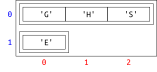

# 2D-Listen

## Grundlagen

Listen bestehen aus Elementen, die denselben Typ haben. Z. B. bestehen
die Listen `xs` und `ys` aus Zeichen. Für Zeichen in Listen brauchen wir
den Objekttyp `Character` (statt `char`).

```java, java-exec
import java.util.List;
List<Character> xs = List.of('G', 'H', 'S');
List<Character> ys = List.of('E');
```

Anders ausgedrückt haben `xs` und `ys` den Typ `List<Character>`.

Da `xs` und `ys` denselben Typ haben, können wir diese beiden Listen in
einer neuen Liste abspeichern.

```java, java-exec
List<List<Character>> zs = List.of(xs, ys);
```

Da die Elemente in `zs` den Typ `List<Character>` haben, hat `zs` den Typ
`List<List<Character>>`. Dies wird auch deutlich, wenn man die Liste `zs`
anzeigt.

```java, java-exec
zs
```

## Zugriff auf Elemente

Wenn wir mit `get` auf ein Element in `zs` zugreifen, erhalten wir eine
Liste von Zeichen.

```java, java-exec
zs.get(1)
```

Erst wenn wir anschließend auf ein Element in dieser Liste zugreifen,
erhalten wir ein Zeichen.

```java, java-exec
zs.get(1).get(0)
```

In der folgenden Grafik stehen die Listen in `zs` als Zeilen
untereinander. Auf der linken Seite stehen die Indizes dieser
Listen/Zeilen in `zs`. Unten stehen die Indizes der Zeichen in diesen
Listen. Diese geben an, in welcher Spalte sich ein Element befindet.



Jedes Zeichen hat genau einen Zeilen- und einen Spaltenindex genauso wie
Punkte in einer zweidimensionalen Ebene genau eine \\(x\\)- und
\\(y\\)-Koordinate haben. Deshalb bezeichnet man Listen, deren Elemente
selbst Listen sind, auch als 2D-Listen.

## Iteration über 2D-Listen

Wenn wir über eine 2D-Liste iterieren, durchläuft die Zählervariable die
Listen in der 2D-Liste.

```java, java-exec
for (List<Character> l : zs) {
    IO.println(l);
}
```

Um wirklich die Elemente in diesen Listen zu durchlaufen, müssen wir im
Schleifenkörper nochmal eine Schleife nutzen.

```java, java-exec
for (List<Character> l : zs) {
    for (char x : l) {
        IO.println(x);
    }
}
```

Verschachtelte Schleifen sind oft schwer lesbar. Die Lesbarkeit
verbessert sich, wenn wir die innere Schleife in eine Methode
extrahieren.

```java, java-exec
void printCharList(List<Character> xs) {
    for (char x : xs) {
        IO.println(x);
    }
}
for (List<Character> l : zs) {
    printCharList(l);
}
```

## Ebenen nicht vermischen

Die Liste `xs` hat den Typ `List<Integer>`.

```java, java-exec
import java.util.ArrayList;
var xs = new ArrayList<>(List.of(5, 1));
```

Die Liste `xxs` enthält Elemente vom Typ `List<Integer>`.

```java, java-exec
var xxs = new ArrayList<>(List.of(new ArrayList<>(List.of(1, 3)), new ArrayList<>(List.of(2, 45))));
```

Trotzdem ist es nicht möglich, eine einzelne Zahl an `xxs` anzuhängen:
`add` erwartet ein Element vom Typ `List<Integer>`.

```java, java-exec
xxs.add(5);
```

Eine Liste lässt sich dagegen anhängen, weil die Ebenen stimmen.

```java, java-exec
xxs.add(xs);
xxs
```

## Aufgaben

[Zu den Aufgaben zu diesem Kapitel](./2d_listen_aufgaben.md)
