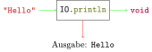
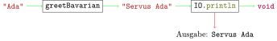

<!-- ```java, java-exec
String greetBavarian(String name) {
    return "Servus " + name;
}
void greetBavarianPrint(String name) {
    IO.println("Servus " + name);
}
void printHelloAndGoodbye() {
    IO.println("Hello");
    IO.println("Goodbye");
}
String helloAndGoodbyeWrong() {
    return "Hello";
    IO.println("Goodbye");
}
``` -->

# Ausgabe mit IO.println

## Motivation

Der Zweck der Methoden, die wir bisher geschrieben haben, war immer
die Berechnung und *Rückgabe* eines *Werts*. Wenn wir einen *Ausdruck*,
der einen Methodenaufruf enthält, in eine Zelle eingeben, wird der
Methodenaufruf ausgewertet, um den *Wert* des *Ausdrucks* zu berechnen.
Dieser wird dann in der nächsten Zeile angezeigt.

```java, java-exec
String greetBavarian(String name) {
    return "Servus " + name;
}
```

```java, java-exec
greetBavarian("Ada")
```


Normalerweise steht Programmcode aber nicht in mehreren Zellen, sondern in einer
Textdatei. Solche Textdateien mit Programmcode nennt man *Skript*.

Wenn wir eine dieser Methoden in einem Skript aufrufen, hat das für
den Benutzer keinen sichtbaren Effekt. Der Methodenaufruf bzw. der
*Ausdruck* wird ausgewertet, und die Umgebung fährt mit der nächsten
Zeile fort.

```java, java-exec
String greetBavarian(String name) {
    return "Servus " + name;
}
greetBavarian("Ada")
```


Die Benutzerinnen und Benutzer eines Programms wollen aber nicht
Methodenaufrufe in eine Zelle eingeben. Sie wollen einfach ein Skript
oder Programm starten und danach etwas Nützliches angezeigt bekommen und
ggf. etwas eingeben. In diesem Kapitel wollen wir uns anschauen, wie das
funktioniert.

## Ausgabe

Um Werte bei der Ausführung eines Skripts anzuzeigen, können wir die
Methode `IO.println` nutzen.


```java, java-exec
IO.println("Hello")
```

Hierbei fällt auch auf, dass die Anführungszeichen nicht angezeigt werden.
Das entspricht dem Verhalten von Programmen, die du verwendest.

Wir können `IO.println` auch verwenden, um den Rückgabewert von
`greetBavarian("Ada")` anzuzeigen.

```java, java-exec
String greetBavarian(String name) {
    return "Servus " + name;
}
IO.println(greetBavarian("Ada"))
```

Die gleiche Ausgabe kann auch erreicht werden, wenn wir in der
Definition von `greetBavarian` statt `return` `IO.println` verwenden.

```java, java-exec
void greetBavarianPrint(String name) {
    IO.println("Servus " + name);
}
greetBavarianPrint("Ada")
```

Die Ausgabe erfolgt dann durch die Methode selbst und nicht erst danach,
wie im letzten Beispiel.

## Fehlender Rückgabewert


Im Gegensatz zu allen Methoden, die wir bisher gesehen haben, hat
diese Methode keinen Rückgabewert. Statt `String` oder `int` steht dort
`void`. Die Methode ist trotzdem sehr nützlich, weil sie ihr Argument
auf der Konsole ausgibt.






## Unterschiede zwischen Rückgabe und Ausgabe

Es ist wichtig, sich den Unterschied zwischen der Rückgabe mit `return`
und der Ausgabe mit `IO.println` klar zu machen. Ein zurückgegebener *Wert*
kann in einer Rechnung verwendet werden.

```java, java-exec
String greetBavarian(String name) {
    return "Servus " + name;
}
```

```java, java-exec
greetBavarian("Ada")
```


Bei der Auswertung in einem Skript wird er aber nicht automatisch angezeigt. Mit der Methode
`IO.println` können wir Werte auch dann anzeigen, wenn ein Skript ausgeführt wird. Diese Methode gibt
den Wert aber **nicht** zurück. Die Methoden `greetBavarian` und
`greetBavarianPrint` sehen deshalb sehr ähnlich aus. Sie sind aber
trotzdem sehr unterschiedlich.


```java, java-exec
void greetBavarianPrint(String name) {
    IO.println("Servus " + name);
}
```

```java, java-exec
greetBavarianPrint("Ada")
```

`Servus Ada` ist ein *Wert*, der von der Methode `greetBavarianPrint`
ausgegeben wurde. Einen Rückgabewert gibt es bei diesem Methodenaufruf
nicht. Der Unterschied wird deutlich, wenn man den Methodenaufruf in
einem Ausdruck verwendet.

```java, java-exec
greetBavarianPrint("Ada") + "!"
```

Die Fehlermeldung sagt aus, dass eine Methode ohne Rückgabewert (`void`)
nicht in einem *Ausdruck* verwendet werden kann.


Der Unterschied wird auch deutlich, wenn man das Ergebnis dieser
Methoden in einer *Variablen* speichern will.

```java, java-exec
var x = greetBavarian("Ada");
x
```

Bei der Zuweisung in der ersten Zeile wird der *Wert* von
`greetBavarian("Ada")` zwar berechnet und der *Variablen* zugewiesen.
Es ist aber nichts zu sehen. Der *Wert* der *Variablen* `x` ist
`"Servus Ada"` und wird deshalb nach der zweiten Zeile angezeigt.

Bei der Verwendung von `greetBavarianPrint` geht das gar nicht erst.

```java, java-exec
var x = greetBavarianPrint("Ada");
```

Da `greetBavarianPrint` nichts zurückgibt, kann auch nichts in einer
*Variablen* gespeichert werden. Die Umgebung meldet einen Fehler.

Der letzte wichtige Unterschied ist, dass bei der Ausführung eines
`return`-*Statements* die Methode, die dieses enthält, verlassen wird.
Java lässt Code hinter `return` gar nicht erst zu.

```java, java-exec
String helloAndGoodbyeWrong() {
    return "Hello";
    IO.println("Goodbye");
}
```

Die Fehlermeldung sagt aus, dass die zweite Zeile unerreichbar ist. Das
zeigt: Nach `return` wird die Methode sofort verlassen.

Bei Aufrufen von `IO.println` ist dies nicht der Fall.

```java, java-exec
void printHelloAndGoodbye() {
    IO.println("Hello");
    IO.println("Goodbye");
}
```

```java, java-exec
printHelloAndGoodbye()
```

## Aufgaben

[Zu den Aufgaben zu diesem Kapitel](./ausgabe_mit_print_aufgaben.md)
