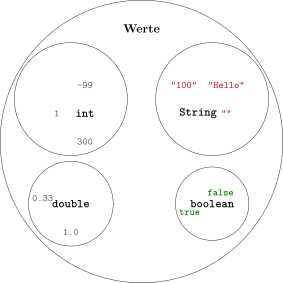

# Datentypen

## Einteilung von Werten in Datentypen

Wir haben mit *Integern* und *Strings* zwei verschiedene Arten von
*Werten* kennengelernt und gesehen, dass mit verschiedenen Arten von
*Werten* unterschiedliche *Operationen* durchgeführt werden können. Eine
solche Menge von *Werten*, die bestimmte *Operationen* unterstützt,
nennt man *(Daten-)Typ*. Die *Typen*, die wir in diesem Schuljahr
kennenlernen werden, sind in der folgenden Abbildung dargestellt.



`String` steht für Zeichenkette, und `int` für *Integer*. Diese
*Typen* haben wir schon genutzt, um zu kennzeichnen, zu welchem Datentyp die
*Argumente* und der Rückgabewert einer Methode gehören. Die weiteren
*Typen* werden wir in den folgenden Kapiteln kennenlernen.

## Typfehler

*Operationen* sind immer nur für bestimmte Kombinationen von *Typen*
definiert. Wir haben schon gesehen, dass man einen *String* mit
`repeat` vervielfachen kann.

```java, java-exec
"good bye ".repeat(3)
```

Wir können aber **nicht** einen *String* und ein *Integer* addieren.

```java, java-exec
1 + "2"
```

Die Fehlermeldung sagt aus, dass der *Operator* `+` nicht definiert ist,
wenn der linke *Operand* ein *Integer* und der rechte *Operand* ein
*String* ist.

## Automatische Umwandlung bei Strings

Andersherum funktioniert die Addition: Steht der *String* links und ein
*Integer* rechts, wird der *Integer* automatisch in einen *String*
umgewandelt.

```java, java-exec
"The value of number is: " + 3
```

Deshalb brauchen wir in Java keine Umwandlung, um eine Zahl in einen
Text einzubauen.

## Typumwandlung von String nach Integer

Umgekehrt geht das nicht automatisch: Ein *String*, der eine Zahl
darstellt, kann mit `Integer.parseInt` in einen *Integer* umgewandelt
werden.

```java, java-exec
Integer.parseInt("052")
```

Aber natürlich kann nicht jeder *String* zu einem *Integer* konvertiert
werden.

```java, java-exec
Integer.parseInt("hello")
```

## Aufgaben

[Zu den Aufgaben zu diesem Kapitel](./datentypen_aufgaben.md)
