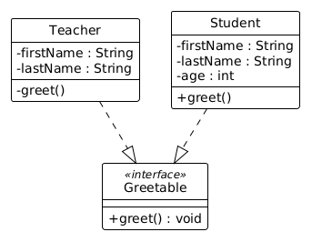

# Interfaces

## Motivation

Mit dem folgenden Code definieren wir die Records `Teacher` und
`Student`. Beide haben eine `greet`-Methode.

```java, java-exec
record Teacher(String firstName, String lastName) {
    public void greet() {
        IO.println("Hello, I am " + firstName + " " + lastName);
    }
}
record Student(String firstName, String lastName, int age) {
    public void greet() {
        IO.println("Yo, I am " + firstName);
    }
}
```

```java, java-exec
var herrMueller = new Teacher("Dieter", "Mueller");
herrMueller.greet();
```
```java, java-exec
var alex = new Student("Alex", "Hoffmann", 18);
alex.greet();
```

Wenn sich ein Schüler zweimal vorstellen soll, kann man dafür folgende
Methode schreiben:

```java, java-exec
class Utils {
    static void letStudentGreetTwoTimes(Student student) {
        student.greet();
        student.greet();
    }
}
```

```java, java-exec
Utils.letStudentGreetTwoTimes(alex);
```

Obwohl die Methode für Lehrer genauso aufgebaut wäre, kann sie nur mit
Schülern aufgerufen werden.

```java, java-exec
Utils.letStudentGreetTwoTimes(herrMueller);
```

Für Lehrer braucht man deshalb eine zweite Methode.

```java, java-exec
class Utils {
    static void letTeacherGreetTwoTimes(Teacher teacher) {
        teacher.greet();
        teacher.greet();
    }
}
```

```java, java-exec
Utils.letTeacherGreetTwoTimes(herrMueller);
```

## Interfaces

Um diese Codewiederholung zu vermeiden, kann man ein *Interface*
definieren.

```java, java-exec
interface Greetable {
    void greet();
}
```

Jede Klasse, die das Interface `Greetable` implementiert, muss die
Methode `greet` implementieren. Die Methode hat keine Parameter und
liefert keinen Rückgabewert.

Wir können jetzt deklarieren, dass der Record `Teacher` das Interface
implementiert. Das geschieht mit dem Schlüsselwort `implements`.

```java, java-exec
record Teacher(String firstName, String lastName) implements Greetable {
    @Override
    public void greet() {
        IO.println("Hello, I am " + firstName + " " + lastName);
    }
}
```

Vor jeder Implementierung einer Interface-Methode sollte `@Override`
stehen.

Genauso implementiert auch `Student` das Interface.

```java, java-exec
record Student(String firstName, String lastName, int age) implements Greetable {
    @Override
    public void greet() {
        IO.println("Yo, I am " + firstName);
    }
}
```

```java, java-exec
var herrMueller = new Teacher("Dieter", "Mueller");
var alex = new Student("Alex", "Hoffmann", 18);
```

`Student` und `Teacher` können jetzt als `Greetable`-Referenzen
gespeichert werden.

```java, java-exec
Greetable greetingAlex = alex;
Greetable greetingMueller = herrMueller;
```

Über diese Referenzen können weiterhin die Methoden des Interfaces
verwendet werden.

```java, java-exec
greetingAlex.greet();
```

Andere Methoden der konkreten Klasse sind dann nicht mehr direkt
nutzbar.

```java, java-exec
greetingAlex.firstName();
```

Wenn wir `Greetable` als Parametertyp nutzen, können wir die beiden
Methoden von oben zu einer Methode zusammenfassen.

```java, java-exec
class Utils {
    static void letGreetTwoTimes(Greetable greetable) {
        greetable.greet();
        greetable.greet();
    }
}
```

```java, java-exec
Utils.letGreetTwoTimes(greetingAlex);
Utils.letGreetTwoTimes(greetingMueller);
```

## Interfaces und Listen

Die Objekte `alex` und `herrMueller` gehören zu unterschiedlichen
Klassen, implementieren aber beide das Interface `Greetable`. Deshalb
können sie in einer `List<Greetable>` gespeichert werden.

```java, java-exec
import java.util.List;
List<Greetable> greeters = List.of(alex, herrMueller);
```

So kann man Methoden definieren, die eine Liste von Objekten erhalten,
die ein Interface implementieren.

```java, java-exec
class Utils {
    static void showGreetings(List<Greetable> greetables) {
        for (Greetable greetable : greetables) {
            greetable.greet();
        }
    }
}
```

```java, java-exec
Utils.showGreetings(greeters);
```

## Typen, die ein Interface implementieren, präzisieren

Eine Methode mit dem Parametertyp `List<Greetable>` kann zwar gemischte
Listen verarbeiten, aber keine `List<Student>` oder `List<Teacher>`
direkt annehmen.

Wenn gemischte Listen nicht erlaubt sein sollen und die Methode trotzdem
sowohl mit einer `List<Student>` als auch mit einer `List<Teacher>`
funktionieren soll, verwenden wir einen Typparameter `T` und begrenzen
ihn mit `extends Greetable`.

Das bedeutet: `T` darf nur ein Typ sein, der `Greetable` implementiert.

```java, java-exec
class Utils {
    static <T extends Greetable> void showGreetingsNotMixed(List<T> greetables) {
        for (Greetable greetable : greetables) {
            greetable.greet();
        }
    }
}
```

```java, java-exec
var students = List.of(new Student("Alex", "Hoffmann", 18), new Student("Nino", "Clermont", 15));
var teachers = List.of(new Teacher("Dieter", "Mueller"), new Teacher("Klaus", "Mueller"));
Utils.showGreetingsNotMixed(students);
Utils.showGreetingsNotMixed(teachers);
```

Der gleiche Typparameter kann auch für den Rückgabewert genutzt werden.
So bleibt der konkrete Typ erhalten: Bei einer `List<Student>` liefert
die Methode ein `Student`-Objekt zurück, bei einer `List<Teacher>` ein
`Teacher`-Objekt.

```java, java-exec
class Utils {
    static <T extends Greetable> T greetAndReturnFirst(List<T> greetables) {
        T first = greetables.getFirst();
        first.greet();
        return first;
    }
}
```

```java, java-exec
Student firstStudent = Utils.greetAndReturnFirst(students);
Teacher firstTeacher = Utils.greetAndReturnFirst(teachers);
```

Die letzten beiden Zuweisungen wären nicht möglich, wenn der
Rückgabewert nur `Greetable` wäre. Dann ginge die Information über den
konkreten Typ verloren.

## Interface-Erweiterung

Wir können auch Interfaces definieren, die ein bestehendes Interface
erweitern.

```java, java-exec
interface CanGreetAndSayGoodbye extends Greetable {
    void sayGoodbye();
}
```

Damit eine Klasse das Interface `CanGreetAndSayGoodbye` implementiert,
muss sie auch `Greetable` implementieren und zusätzlich die Methode
`void sayGoodbye()` implementieren.

```java, java-exec
record Student(String firstName, String lastName, int age) implements CanGreetAndSayGoodbye {
    @Override
    public void greet() {
        IO.println("Yo, I am " + firstName);
    }
    @Override
    public void sayGoodbye() {
        IO.println("Tschuess!");
    }
}
```

```java, java-exec
var alex = new Student("Alex", "Hoffmann", 18);
alex.sayGoodbye();
```

## UML

Interfaces können auch in UML dargestellt werden. Sie werden wie Klassen
als Rechteck dargestellt. Über dem Namen des Interfaces steht
`<<interface>>`. Klassen, die das Interface implementieren, sind mit
diesem durch einen Pfeil mit weißer Spitze verbunden. Die Klassen zeigen
dadurch auf das Interface.



## Aufgaben

[Zu den Aufgaben zu diesem Kapitel](./interfaces_aufgaben.md)
