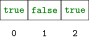

# Listen

## Motivation

Wir haben gesehen, dass ein *String* aus einzelnen Buchstaben besteht,
auf die wir zugreifen können. Man sagt auch, dass ein *String* ein
*Container* ist. Auch für andere *Datentypen* ist es möglich, mehrere
Werte in einem Container zu speichern. Dafür verwenden wir sogenannte
*Listen*.

## Listen sind Werte

In einer *Liste* können mehrere *Werte* mit demselben *Typ* gespeichert
werden. Eine *Liste* wird erzeugt, indem wir die Elemente durch Kommas
getrennt in `List.of(...)` auflisten.

```java, java-exec
import java.util.List;
List<Boolean> xs = List.of(true, false, true);
xs
```

Da `List` nicht automatisch bekannt ist, brauchen wir einmal die erste
Zeile. Alle weiteren Blöcke auf dieser Seite können `List` danach
direkt verwenden.

Der *Typ* der Elemente wird in spitzen Klammern geschrieben. Für
*Listen* brauchen wir die Objekttypen (`Boolean` statt `boolean`,
`Integer` statt `int`, `String` bleibt `String`).

*Listen* beinhalten *Werte* und sind selbst wieder *Werte*. Wir können
*Listen* also in *Variablen* speichern.

## Iteration über Listen

Listen können mit `for`-Schleifen durchlaufen werden.

```java, java-exec
List<Boolean> xs = List.of(true, false);
for (boolean x : xs) {
    IO.println(x);
}
```

Hinter `for` steht in runden Klammern der *Typ* und ein Name für das
aktuelle Element, gefolgt von einem Doppelpunkt und der *Liste*. Bei
jedem Durchlauf enthält die Variable das nächste Element.

## Elemente hinzufügen

Mit `List.of` erzeugte *Listen* lassen sich nicht verändern. Wenn wir
trotzdem eine längere *Liste* wollen, ersetzen wir die *Liste* durch
eine neue *Liste*, die aus der alten *Liste* und dem neuen Element
besteht.

```java, java-exec
List<Boolean> xs = List.of(true, false, true);
```


```java, java-exec
var longer = new ArrayList<>(xs);
longer.add(false);
xs = longer;
xs
```


## Listen als Container

In den nächsten Abschnitten werden wir *Listen* als Container benutzen,
so wie wir das schon mit *Strings* getan haben.

Auch die Elemente einer *Liste* haben *Indizes*, die mit \\(0\\) beginnen.
Mit der Methode `get` und dem *Index* in runden Klammern können wir auf
diese Elemente zugreifen.


```java, java-exec
List<String> x = List.of("hello", "how", "are", "you");
x.get(2)
```

Das funktioniert natürlich auch, wenn einer der *Ausdrücke* zuerst
ausgewertet werden muss.

```java, java-exec
List<String> x = List.of("hello", "how", "are", "you");
x.get(3)
```

Die *Indizes* der *Liste* `[true, false, true]` gehen nur von \\(0\\) bis
\\(2\\). Wenn wir einen *Index* über \\(2\\) verwenden, erhalten wir einen
Fehler.

```java, java-exec
List<Boolean> xs = List.of(true, false, true);
xs.get(3)
```

## Länge einer Liste bestimmen

Die Länge einer *Liste* kann mit der Methode `size` bestimmt werden.

```java, java-exec
List<Boolean> xs = List.of(true, false, true);
xs.size()
```

Da die *Indizes* einer *Liste* bei \\(0\\) anfangen, ist der höchste
*Index* um eins kleiner als die Länge.

## Iteration über Indizes

Wir können mit einer `for`-*Schleife* über die *Indizes* einer *Liste*
iterieren. Im *Schleifenkörper* können wir die *Zählervariable* nutzen,
um nacheinander auf die Elemente in der *Liste* zuzugreifen.

```java, java-exec
List<Boolean> xs = List.of(true, false, true, false);
for (int i = 0; i < xs.size(); i = i + 1) {
    IO.println(xs.get(i));
}
```

Wenn man Startwert und Bedingung der Zählervariablen anpasst, kann man
auch nur über einen Teil der Liste iterieren.

```java, java-exec
List<Boolean> xs = List.of(true, false, true, false);
for (int i = 1; i < xs.size() - 1; i = i + 1) {
    IO.println(xs.get(i));
}
```

## Listen als Parameter und Rückgabewerte

*Listen* sind *Werte* wie alle anderen. Darum können sie auch
*Parameter* und *Rückgabewerte* von Methoden sein.

```java, java-exec
import java.util.ArrayList;
import java.util.List;
List<Integer> mapTimesTwo(List<Integer> xs) {
    var result = new ArrayList<Integer>();
    for (int x : xs) {
        result.add(x * 2);
    }
    return result;
}
```

```java, java-exec
mapTimesTwo(List.of(1, 2, 3))
```

## Aufgaben

[Zu den Aufgaben zu diesem Kapitel](./listen_aufgaben.md)
