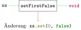

# Listen verändern

## Übersicht

Wir haben bis jetzt nur unveränderliche *Werte* genutzt. Wir konnten
zwar den *Wert* einer *Variablen* durch einen neuen *Wert* ersetzen aber
**nicht** den *Wert* selbst ändern. Bei *Listen*, die wir mit
`new ArrayList<>(...)` erzeugen, ist dies jedoch möglich.

```java, java-exec
import java.util.ArrayList;
import java.util.List;
var xs = new ArrayList<>(List.of(true));
xs
```

## Elemente zur Liste hinzufügen

Mit der Methode `add` können wir ein Element zu einer *Liste*
hinzufügen. Hierbei wird tatsächlich der *Wert* selbst geändert.


```java, java-exec
xs.add(false);
```


```java, java-exec
xs
```

## Elemente austauschen

Wir können ein Element einer *Liste* durch ein neues Element ersetzen.
Hierfür rufen wir die Methode `set` mit dem *Index* des Elements, das
wir austauschen wollen, und dem neuen *Wert* auf.

```java, java-exec
xs = new ArrayList<>(List.of(true, false, true));
```

```java, java-exec
xs.set(2, false);
```
```java, java-exec
xs
```

Auch hier wird tatsächlich der *Wert* der *Liste* geändert.

## Schwierigkeiten beim Umgang mit veränderlichen Werten

Eine Schwierigkeit beim Umgang mit veränderlichen *Werten* sehen wir,
wenn wir zwei *Variablen* erstellen, die auf denselben *Wert* verweisen.

```java, java-exec
var xs = new ArrayList<>(List.of(true, false, true));
```
```java, java-exec
var ys = xs;
```


```java, java-exec
ys.set(2, false);
```


```java, java-exec
xs
```

## Listen in Methoden ändern

Eine Methode kann eine *Liste*, die ihr übergeben wird ändern. Als
*Typ* schreiben wir `List`, erzeugt wird eine `ArrayList`.

```java, java-exec
void setFirstFalse(List<Boolean> xs) {
    xs.set(0, false);
}
```

```java, java-exec
var xs = new ArrayList<>(List.of(true, true));
```
```java, java-exec
setFirstFalse(xs);
```
```java, java-exec
xs
```



## Unveränderliche Sicht

Mit `List.of` erzeugte Listen lassen sich grundsätzlich nicht ändern,
auch nicht mit `add`. Der Versuch bricht mit einem Fehler ab.

```java, java-exec
import java.util.List;
List<Integer> xs = List.of(1, 3, 5);
xs.add(7);
```

Lesen geht trotzdem: `get` und `size` funktionieren wie gewohnt. Wer
ändern will, nimmt eine `ArrayList`.

## Aufgaben

[Zu den Aufgaben zu diesem Kapitel](./listen_aendern_aufgaben.md)
