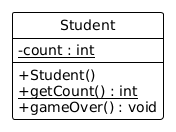

# Statische Methoden und Eigenschaften

## Statische Methoden

Mit dem folgenden Code wird eine Methode definiert, die das Quadrat
einer Zahl berechnet.

```java, java-exec
class Utils {
    int square(int x) {
        return x * x;
    }
}
```

Um diese aufzurufen, müssen wir zunächst ein Objekt der Klasse `Utils`
erzeugen.

```java, java-exec
var utils = new Utils();
utils.square(3)
```

Die Methode verwendet keine Eigenschaften. Deshalb können wir sie auch
als statische Methode deklarieren. Dazu schreiben wir das Schlüsselwort
`static` an den Anfang der Methodendefinition.

```java, java-exec
class Utils {
    static int square(int x) {
        return x * x;
    }
}
```

Statische Methoden werden nicht auf einem Objekt aufgerufen, sondern
auf der Klasse selbst.

```java, java-exec
Utils.square(3)
```

## Statische Eigenschaften

Genauso können wir *statische* Eigenschaften definieren, die nicht zu
den einzelnen Objekten, sondern der gesamten Klasse gehören. Im
folgenden Beispiel wird eine *statische* Eigenschaft `count` definiert.
Diese wird bei jedem Aufruf des Konstruktors der Klasse erhöht.

```java, java-exec
class Student {
    static int count;
    Student() {
        count = count + 1;
    }
}
```

```java, java-exec
IO.println(Student.count);
```
```java, java-exec
var pana = new Student();
IO.println(Student.count);
```
```java, java-exec
var nino = new Student();
IO.println(Student.count);
```

Im Gegensatz zu Objekteigenschaften kann auch in statischen Methoden
auf statische Eigenschaften zugegriffen werden.

```java, java-exec
class Student {
    private static int count;
    Student() {
        count = count + 1;
    }
    static int getCount() {
        return count;
    }
}
```

```java, java-exec
var pana = new Student();
var nino = new Student();
IO.println(Student.getCount());
```

Wir können aber auch in nicht-statischen Methoden auf statische
Eigenschaften zugreifen.

```java, java-exec
class Student {
    private static int count;
    Student() {
        count = count + 1;
    }
    static int getCount() {
        return count;
    }
    void gameOver() {
        count = count - 1;
    }
}
```

```java, java-exec
var pana = new Student();
var nino = new Student();
IO.println(Student.getCount());
```

```java, java-exec
pana.gameOver();
nino.gameOver();
IO.println(Student.getCount());
```

Statische Eigenschaften werden wie statische Methoden im
Klassendiagramm unterstrichen.



## Aufgaben

[Zu den Aufgaben zu diesem Kapitel](./statische_methoden_aufgaben.md)
