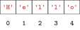

# Strings als Buchstaben-Container

## Motivation

*Strings* sind aus einzelnen Buchstaben zusammengesetzt. Wenn wir die
Buchstaben eines *Strings* von null beginnend durchnummerieren, steht
unter jedem Buchstaben eine Zahl, die *Index* genannt wird.



Mit einem *String* und dem *Index* eines Buchstabens in diesem *String*
können wir auf den Buchstaben zugreifen. Hierfür schreiben wir hinter
den *String* einen Punkt, die Methode `charAt` und den *Index* in
runden Klammern.

```java, java-exec
"hello".charAt(0)
```
```java, java-exec
"hello".charAt(2)
```

Das funktioniert natürlich auch, wenn einer der *Ausdrücke* vor oder in
der Klammer zuerst ausgewertet werden muss.

```java, java-exec
("good" + "bye").charAt(3 + 2)
```
```java, java-exec
String x = "hello";
```
```java, java-exec
x.charAt(3)
```

Die *Indizes* des *Strings* `"hello"` gehen nur von \\(0\\) bis \\(4\\).
Wenn wir einen *Index* größer als \\(4\\) verwenden, erhalten wir einen
Fehler.

```java, java-exec
"hello".charAt(5)
```

## Länge eines Strings bestimmen

Die Länge eines *Strings* kann mit der Methode `length` bestimmt werden.

```java, java-exec
"hello".length()
```

Da die *Indizes* eines *Strings* bei \\(0\\) anfangen, ist der höchste
*Index* um eins kleiner als die Länge.

## Iteration über Indizes

Wir können mit einer `for`-*Schleife* über die *Indizes* eines *Strings*
iterieren. Hierbei schreiben wir in die Bedingung die Länge des
*Strings*. Dadurch ist die *Zählervariable* bei der letzten
Wiederholung um eins kleiner als die Länge, was ja gerade dem höchsten
*Index* entspricht.

```java, java-exec
for (int i = 0; i < "hello".length(); i = i + 1) {
    IO.println(i);
}
```
```java, java-exec
for (int i = 0; i < "bye".length(); i = i + 1) {
    IO.println(i);
}
```

Im *Schleifenkörper* können wir die *Zählervariable* nutzen, um
nacheinander auf die Buchstaben im *String* zuzugreifen.

```java, java-exec
String greeting = "hello";
for (int i = 0; i < greeting.length(); i = i + 1) {
    IO.println(greeting.charAt(i));
}
```

Dabei können wir Startwert und Bedingung anpassen, um nur einen Teil des
Strings zu durchlaufen.

```java, java-exec
String greeting = "hello";
for (int i = 1; i < greeting.length() - 1; i = i + 1) {
    IO.println(greeting.charAt(i));
}
```

## Aufgaben

[Zu den Aufgaben zu diesem Kapitel](./strings_als_container_aufgaben.md)
