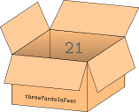

# Variablen

## Motivation

Die folgende Mathematikaufgabe können wir einfach in der Zelle lösen.


**Mathematikaufgabe 1**. *Für die englischen Längeneinheiten Fuß, Yard
und Zoll (Inch) gelten:*

- *Ein Yard sind 3 Fuß.*

- *Ein Fuß sind 12 Zoll.*

*Wie viel sind 7 Yard in Fuß und in Zoll?*


**Lösung 1**

```java, java-exec
3 * 7
```
```java, java-exec
3 * 7 * 12
```


Hierbei fällt auf, dass der *Ausdruck* `3 * 7` doppelt vorkommt und
deshalb auch doppelt ausgewertet wird. Um dies zu vermeiden und
gleichzeitig die Lesbarkeit zu verbessern, können wir *Variablen*
nutzen.

## Variablen erstellen

Man kann sich eine *Variable* als Box mit einem Namen und einem Inhalt
vorstellen.

<div align="center">

</div>

Eine Variable wird mit einem *Zuweisungs-Statement* *initialisiert*
(erstellt). Dabei brauchen wir `var` oder einen *Typ* (mehr dazu im
Kapitel [Typ und Inferenz](./typ_und_inferenz.md)).

```java, java-exec
var threeYardsInFeet = 3 * 7;
```

Auf der linken Seite des *Zuweisungsoperators* (`=`) steht der Name der
*Variablen*. Auf der rechten Seite steht ein *Ausdruck*. Bei der
Ausführung dieses *Statements* wird zunächst der *Ausdruck* auf der
rechten Seite ausgewertet. Der *Wert* des *Ausdrucks* wird dann unter
dem angegeben Namen gespeichert.

Allgemein ist ein *Statement* eine Anweisung an die Java-Umgebung.
Bei *Zuweisung-Statements* weisen wir diese an, eine *Variable*
anzulegen[^1].

## Variablen in Ausdrücken verwenden

Wir können jetzt den *Variablennamen* in *Ausdrücken* verwenden. Bei der
Auswertung wird der *Variablenname* durch den *Wert* der *Variable*
ersetzt

```java, java-exec
threeYardsInFeet
```
```java, java-exec
12 * threeYardsInFeet
```

Wir können eine *Variable* auch bei der *Initialisierung* einer neuen
*Variablen* verwenden.

```java, java-exec
var threeYardsInInch = 12 * threeYardsInFeet;
threeYardsInInch
```

## Undefinierte Variablen

Wenn wir in einem *Ausdruck* eine *Variable* nutzen, die noch nicht
definiert wurde, werden wir darauf hingewiesen.

```java, java-exec
x
```

Gerade bei längeren *Variablennamen* schleichen sich schnell
Schreibfehler ein.

```java, java-exec
threeYardInInch
```

## Erlaubte Variablennamen

*Variablennamen* müssen mit einem Buchstaben beginnen.

```java, java-exec
var 2YardsInFeet = 6;
```

Außerdem dürfen in *Variablennamen* nur Buchstaben, Zahlen und
Unterstriche verwendet werden.

```java, java-exec
var drei+drei = 6;
```

[^1]: oder ihren Wert zu ändern. Diese Möglichkeit lernen wir jedoch
    erst später kennen

## Aufgaben

[Zu den Aufgaben zu diesem Kapitel](./variablen_aufgaben.md)
